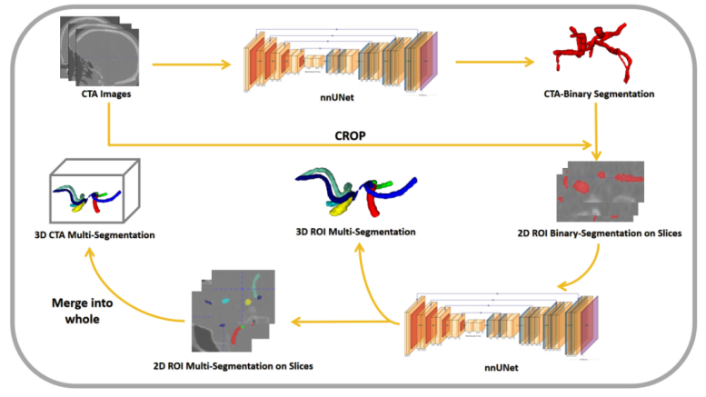

# TopCoW_Challenge
# A Coarse-to-Fine Framework for the Topology-Aware Anatomical Segmentation of the Circle of Willis
Top Solution of [MICCAI TopCoW2023 Challenge](https://topcow23.grand-challenge.org/) 

_Zehang Lin(zhlin@s.xmut.edu.cn),Yusheng Liu(lys_sjtu@sjtu.edu.cn), and Shunzhi Zhu(szzhu@s.xmut.edu.cn)_

School of computer and Information Engineering ,Xiamen University of Technology,
Xiamen 361000, China
Department of Automation, Shanghai Jiao Tong University,
 Shanghai 200240, China

The segmentation framework is shown in Figure below.  
Our algorithm employs a two-step approach for CoW vascular structure segmentation from CT images. 
Initially, we utilize nnU-net for coarse segmentation, followed by cropping the original CT image based on binary results to focus on the CoW vascular region, 
enhancing multi-class segmentation accuracy. Subsequently, the cropped ROI undergoes refinement using a single classification nnU-net, 
with the final multi-class results mapped back to the original image space.



## Environments and Requirements:
### 1. nnUNet Configuration
Install nnU-Net as below.  
You should meet the requirements of nnUNet, our method does not need any additional requirements.  
For more details, please refer to https://github.com/MIC-DKFZ/nnUNet  
```
git clone https://github.com/MIC-DKFZ/nnUNet.git
cd nnUNet
pip install -e .
```
### 2. Pipeline of the Proposed Framework
#### 2.1. Dataset Load and Reconstruction
Load ToothFairy Dataset from https://drive.switch.ch/index.php/s/DBDuXBEBLzlhYPh
```
# Note that TopCoW data has two modalities <mr> and <ct>
topcow_batch-1_40pairMRCT_30062023/
├── bin_labelsTr
│   ├── topcow_ct_roi_024.nii.gz
│   ├── topcow_ct_whole_024.nii.gz
│   ├── topcow_mr_roi_024.nii.gz
│   └── topcow_mr_whole_024.nii.gz
├── imagesTr
│   ├── topcow_ct_roi_024_0000.nii.gz
│   ├── topcow_ct_whole_024_0000.nii.gz
│   ├── topcow_mr_roi_024_0000.nii.gz
│   └── topcow_mr_whole_024_0000.nii.gz
├── mul_labelsTr
│   ├── topcow_ct_roi_024.nii.gz
│   ├── topcow_ct_whole_024.nii.gz
│   ├── topcow_mr_roi_024.nii.gz
│   └── topcow_mr_whole_024.nii.gz
├── roi_size_loc
   ├── topcow_ct_roi_024_axial.png
   ├── topcow_ct_roi_024.txt
   ├── topcow_mr_roi_024_axial.png
   └── topcow_mr_roi_024.txt
```

#### 2.2. Model Training from the Preprocessed Dataset
Conduct automatic preprocessing using nnUNet and train the Teacher(or Student) Model.
```
nnUNet_plan_and_preprocess -t 100 --verify_dataset_integrity
nnUNet_train 3d_fullres nnUNetTrainerV2 100 all
```

### 3. Final Model Encapsulation using Docker
Build the docker based on `dockerfile`
```
sh build.sh
```
Run the docker container to test the final model.
```
docker container run --ipc=host -it --rm --gpus "device=1" --name fairy_nnunetv2 -v /media/ps/lys/CBCT_IAN/Fairy_Tooth/docker/model_generic_unet/   input:/input -v /media/ps/lys/CBCT_IAN/Fairy_Tooth/docker/model_generic_unet/output:/output toothfairy_generic:v1.0
```
The inference process and information (weight path, data info, TTA) could be modified in `test.py`.  
Finally, save the docker images if needed.
```
docker save -o fairy_docker_v0.tar.xz fairy_docker:v0
```
